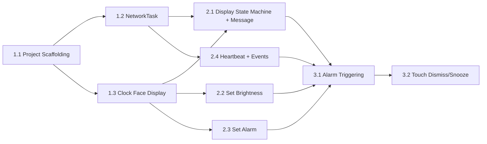

# Story Execution Dependency Graph

## Execution Order

| Story | Depends On | Recommended Agent |
|---|---|---|
| 1.1 Project Scaffolding | None | dev |
| 1.2 NetworkTask | 1.1 | dev |
| 1.3 Clock Face Display | 1.1 | dev |
| 2.1 Display State Machine + Message | 1.2, 1.3 | dev |
| 2.2 Set Brightness | 1.3 | dev |
| 2.3 Set Alarm | 1.3 | dev |
| 2.4 Heartbeat + Events | 1.2 | dev |
| 3.1 Alarm Triggering | 2.1, 2.2, 2.3, 2.4 | dev |
| 3.2 Touch Dismiss/Snooze | 3.1 | dev |

## Key Dependencies

- Stories 1.2 (Network) and 1.3 (Display) can run in parallel after 1.1.
- Stories 2.2, 2.3, 2.4 can run in parallel within their constraints.
- Story 3.1 depends on all of Epic 2 (S21-S24).
- Story 3.2 depends on 3.1 (alarm must ring before it can be dismissed).
